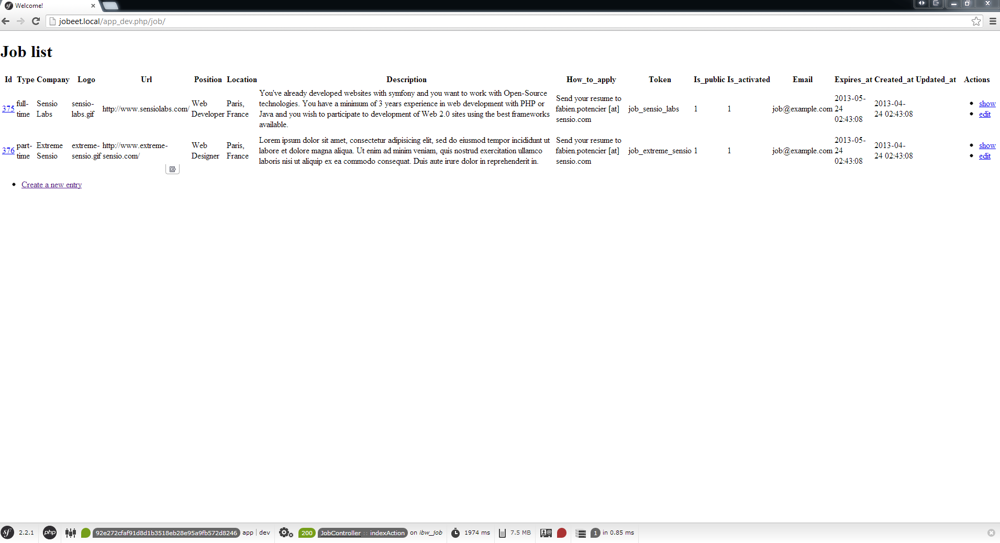

# 第三天：数据模型 #

*这一系列文章来源于Fabien Potencier，基于Symfony1.4编写的[Jobeet Tutirual](http://symfony.com/legacy/doc/jobeet?orm=Doctrine)。

假若你现在极其渴望打开你的文本编辑器来开始写*PHP*代码的话，那么今天的内容就能满足你的心愿了，我们会开始写一些代码了。我们将会定义*Jobeet*中需要使用到的数据模型，并使用*ORM*来和数据库进行交互，并且我们还会为应用创建第一个模块（module）。由于*Symfony*已经为我们做了很多工作，所以我们基本不用写太多的*PHP*代码就能拥有一个功能齐全的模块了。

## 关系模型 ##

在[第二天](https://github.com/happen-zhang/symfony2-jobeet-tutorial/blob/master/chapter-02/chapter-02.md)的用户*stories*中描述了*Jobeet*项目中的主要数据对象：职位（jobs），affiliates和分类（categories）。下面是它们之间的实体关系图：


除了我们在*stories*中描述的列（columns）之外，我们还添加了*created_at*和*updated_at*列。当一个对象被保存到数据库中或者是被更新到数据库中时，*created_at*和*updated_at*这两个列将被自动更新。

## 数据库 ##

为了让职位（jobs），*Affiliates*和分类（categories）能够被存放在数据库中，*Symfony2.3.2*使用了[ORM](http://www.doctrine-project.org/projects/orm.html)工具—[Doctrine](http://www.doctrine-project.org/projects/orm.html)。为了让应用能够连接到数据库，我们需要编辑*app/config/parameters.yml*文件（这里使用的是*MySQL*）：

```YAML
# app/config/parameters.yml
parameters:
    database_driver: pdo_mysql
    database_host: localhost
    database_port: null
    database_name: jobeet
    database_user: root
    database_password: password
    # ...
```

现在我们能让*Doctrine*连接到我们的数据库了。我们能通过在终端输入下面的命令来让*Doctrine*帮助我们生成数据库：

    php app/console doctrine:database:create

## 模式 ##

为了让*Doctrine*能够“了解“我们的对象，我们需要创建“元数据”文件来描述对象在数据库中存放时对应的字段域。我们先在*src/Ibw/JobeetBundle/Resources/config*目录下创建一个*doctrine*目录。*doctrine/*目录下会包含三个文件：*Category.orm.yml*，*Job.orm.yml*和*Affiliate.orm.yml*。

```YAML
# src/Ibw/JobeetBundle/Resources/config/doctrine/Category.orm.yml
Ibw\JobeetBundle\Entity\Category:
    type: entity
    table: category
    id:
        id:
            type: integer
            generator: { strategy: AUTO }
    fields:
        name:
            type: string
            length: 255
            unique: true
    oneToMany:
        jobs:
            targetEntity: Job
            mappedBy: category
    manyToMany:
        affiliates:
            targetEntity: Affiliate
            mappedBy: categories
```

```YAML
# src/Ibw/JobeetBundle/Resources/config/doctrine/Job.orm.yml
Ibw\JobeetBundle\Entity\Job:
    type: entity
    table: job
    id:
        id:
            type: integer
            generator: { strategy: AUTO }
    fields:
        type:
            type: string
            length: 255
            nullable: true
        company:
            type: string
            length: 255
        logo:
            type: string
            length: 255
            nullable: true
        url:
            type: string
            length: 255
            nullable: true
        position:
            type: string
            length: 255
        location:
            type: string
            length: 255
        description:
            type: text
        how_to_apply:
            type: text
        token:
            type: string
            length: 255
            unique: true
        is_public:
            type: boolean
            nullable: true
        is_activated:
            type: boolean
            nullable: true
        email:
            type: string
            length: 255
        expires_at:
            type: datetime
        created_at:
            type: datetime
        updated_at:
            type: datetime
            nullable: true
    manyToOne:
        category:
            targetEntity: Category
            inversedBy: jobs
            joinColumn:
                name: category_id
                referencedColumnName: id
    lifecycleCallbacks:
        prePersist: [ setCreatedAtValue ]
        preUpdate: [ setUpdatedAtValue ]
```

```YAML
# src/Ibw/JobeetBundle/Resources/config/doctrine/Affiliate.orm.yml
Ibw\JobeetBundle\Entity\Affiliate:
    type: entity
    table: affiliate
    id:
        id:
            type: integer
            generator: { strategy: AUTO }
    fields:
        url:
            type: string
            length: 255
        email:
            type: string
            length: 255
            unique: true
        token:
            type: string
            length: 255
        is_active:
            type: boolean
            nullable: true
        created_at:
            type: datetime
    manyToMany:
        categories:
            targetEntity: Category
            inversedBy: affiliates
            joinTable:
                name: category_affiliate
                joinColumns:
                    affiliate_id:
                        referencedColumnName: id
                inverseJoinColumns:
                    category_id:
                        referencedColumnName: id
    lifecycleCallbacks:
        prePersist: [ setCreatedAtValue ]
```

## ORM ##

现在我们在终端输入下面的命令，*Doctrine*能够按照我们的定义来生成对应的类了：

    php app/console doctrine:generate:entities IbwJobeetBundle

现在我们可以在*src/Ibw/JobeetBundle*目录下看到一个*Entity*目录，在*Entity*目录中我们可以看到新生成的文件：*Category.php*，*Job.php*和*Affiliate.php*。打开*Job.php*文件，把*created_at*和*updated_at*的值设置如下：

```PHP
// src/Ibw/JobeetBundle/Entity/Job.php
// ...
 
    /**
     * @ORM\PrePersist
     */
    public function setCreatedAtValue()
    {
        if(!$this->getCreatedAt()) {
            $this->created_at = new \DateTime();
        }
    }
 
    /**
     * @ORM\PreUpdate
     */
    public function setUpdatedAtValue()
    {
        $this->updated_at = new \DateTime();
    }
```

对*Affiliate*类中的*created_at*进行同样的修改：

```PHP
// src/Ibw/JobeetBundle/Entity/Affiliate.php
// ...
 
    /**
     * @ORM\PrePersist
     */
    public function setCreatedAtValue()
    {
        $this->created_at = new \DateTime();
    }
 
// ...
```

上面做的修改会让*Doctrine*在保存对象或者更新对象的时候更新*created_at*和*updated_at*的值。这些*Doctrine*行为被定义在*Affiliate.orm.yml*和*Job.orm.yml*文件的下面。接下来我们让*Doctrine*来帮助我们生成数据表，输入下面的命令：

    php app/console doctrine:schema:update --force

> 这个任务（task）只能在开发环境（development）中使用。如果需要在生产环境（production）中更新你的数据库的话，你可以查看[Doctrine migrations](http://symfony.com/doc/current/bundles/DoctrineMigrationsBundle/index.html)。

现在数据表已经创建好了，但数据表中还没有任何的数据。对于一个*Web*应用来说，它们往往具有三类数据：**初始数据**（应用开始运行时所需要的数据，在*Jobeet*中我们需要初始化用的分类（categories）数据和管理员（admin）数据），**测试数据**（测试应用程序时需要用到的数据）和**用户数据**（用户在使用应用过程中创建的数据）

为了让我们的数据库中能有些**初始数据**，我们使用[DoctrineFixturesBundle](http://symfony.com/doc/current/bundles/DoctrineFixturesBundle/index.html)来帮我们生成数据。我们来按照下面的步骤来安装*DoctrineFixturesBundle*：

### 1、添加下面的代码到*composer.json*中的*require*区块中 ###

```Javascript
// composer.json
// ...
    "require": {
        // ...
        "doctrine/doctrine-fixtures-bundle": "dev-master",
        "doctrine/data-fixtures": "dev-master"
    },
 
// ...
```

### 2、更新*vender*库 ###

    php composer.phar update

### 3、在*app/AppKernel.php*中注册*DoctrineFixturesBundle* ###

```PHP
// app/AppKernel.php
// ...
 
public function registerBundles()
{
    $bundles = array(
        // ...
        new Doctrine\Bundle\FixturesBundle\DoctrineFixturesBundle()
    );
 
    // ...
}
```

现在我们已经准备好*DoctrineFixturesBundle*了，我们在*src/Ibw/JobeetBundle/DataFixtures/ORM/*目录下创建一些新类来加载数据：

```PHP
// src/Ibw/JobeetBundle/DataFixtures/ORM/LoadCategoryData.php
namespace Ibw\JobeetBundle\DataFixtures\ORM;
 
use Doctrine\Common\Persistence\ObjectManager;
use Doctrine\Common\DataFixtures\AbstractFixture;
use Doctrine\Common\DataFixtures\OrderedFixtureInterface;
use Ibw\JobeetBundle\Entity\Category;
 
class LoadCategoryData extends AbstractFixture implements OrderedFixtureInterface
{
    public function load(ObjectManager $em)
    {
        $design = new Category();
        $design->setName('Design');
 
        $programming = new Category();
        $programming->setName('Programming');
 
        $manager = new Category();
        $manager->setName('Manager');
 
        $administrator = new Category();
        $administrator->setName('Administrator');
 
        $em->persist($design);
        $em->persist($programming);
        $em->persist($manager);
        $em->persist($administrator);
        $em->flush();
 
        $this->addReference('category-design', $design);
        $this->addReference('category-programming', $programming);
        $this->addReference('category-manager', $manager);
        $this->addReference('category-administrator', $administrator);
    }
 
    public function getOrder()
    {
        return 1; // the order in which fixtures will be loaded
    }
}
```

```PHP
// src/Ibw/JobeetBundle/DataFixtures/ORM/LoadJobData.php
namespace Ibw\JobeetBundle\DataFixtures\ORM;
 
use Doctrine\Common\Persistence\ObjectManager;
use Doctrine\Common\DataFixtures\AbstractFixture;
use Doctrine\Common\DataFixtures\OrderedFixtureInterface;
use Ibw\JobeetBundle\Entity\Job;
 
class LoadJobData extends AbstractFixture implements OrderedFixtureInterface
{
    public function load(ObjectManager $em)
    {
         $job_sensio_labs = new Job();
         $job_sensio_labs->setCategory($em->merge($this->getReference('category-programming')));
         $job_sensio_labs->setType('full-time');
         $job_sensio_labs->setCompany('Sensio Labs');
         $job_sensio_labs->setLogo('sensio-labs.gif');
         $job_sensio_labs->setUrl('http://www.sensiolabs.com/');
         $job_sensio_labs->setPosition('Web Developer');
         $job_sensio_labs->setLocation('Paris, France');
         $job_sensio_labs->setDescription('You\'ve already developed websites with symfony and you want to work with Open-Source technologies. You have a minimum of 3 years experience in web development with PHP or Java and you wish to participate to development of Web 2.0 sites using the best frameworks available.');
         $job_sensio_labs->setHowToApply('Send your resume to fabien.potencier [at] sensio.com');
         $job_sensio_labs->setIsPublic(true);
         $job_sensio_labs->setIsActivated(true);
         $job_sensio_labs->setToken('job_sensio_labs');
         $job_sensio_labs->setEmail('job@example.com');
         $job_sensio_labs->setExpiresAt(new \DateTime('+30 days'));
         $job_extreme_sensio = new Job();
         $job_extreme_sensio->setCategory($em->merge($this->getReference('category-design')));
         $job_extreme_sensio->setType('part-time');
         $job_extreme_sensio->setCompany('Extreme Sensio');
         $job_extreme_sensio->setLogo('extreme-sensio.gif');
         $job_extreme_sensio->setUrl('http://www.extreme-sensio.com/');
         $job_extreme_sensio->setPosition('Web Designer');
         $job_extreme_sensio->setLocation('Paris, France');
         $job_extreme_sensio->setDescription('Lorem ipsum dolor sit amet, consectetur adipisicing elit, sed do eiusmod tempor incididunt ut labore et dolore magna aliqua. Ut enim ad minim veniam, quis nostrud exercitation ullamco laboris nisi ut aliquip ex ea commodo consequat. Duis aute irure dolor in reprehenderit in.');
         $job_extreme_sensio->setHowToApply('Send your resume to fabien.potencier [at] sensio.com');
         $job_extreme_sensio->setIsPublic(true);
         $job_extreme_sensio->setIsActivated(true);
         $job_extreme_sensio->setToken('job_extreme_sensio');
         $job_extreme_sensio->setEmail('job@example.com');
         $job_extreme_sensio->setExpiresAt(new \DateTime('+30 days'));
 
         $em->persist($job_sensio_labs);
         $em->persist($job_extreme_sensio);
         $em->flush();
    }
 
    public function getOrder()
    {
        return 2; // the order in which fixtures will be loaded
    }
}
```

现在我们已经把*Fixtures*写好了，我们可以使用下面的命令来加载这些数据：

    php app/console doctrine:fixtures:load

现在我们可以去数据库看看，我们将会看到数据表中已经有数据了。

## 查看浏览器 ##

运行下面的命令，它将会创建一个新的控制器（controller）*src/Ibw/JobeetBundle/Controllers/JobController.php*，这个控制器还带有*CURD*动作（Action）。
    
    php app/console doctrine:generate:crud --entity=IbwJobeetBundle:Job --route-prefix=ibw_job --with-write --format=yml

运行命令之后，选择默认的答案（answer）即可，这可能需要被要求做一些配置。

为了能在浏览器中访问到刚生成的控制器，我们需要导入（import）新生成的路由（routes）文件*src/Ibw/JobeetBundle/Resources/config/routing/job.yml*到主路由文件中：

```Yml
# src/Ibw/JobeetBundle/Resources/config/routing.yml
IbwJobeetBundle_job:
        resource: "@IbwJobeetBundle/Resources/config/routing/job.yml"
        prefix:   /job
 
# ...
```

同时我们需要在*Category*类中添加*__toString()*方法，这样做是为了让*Job*表单能够下拉选择类别（category）：

```PHP
// src/Ibw/JobeetBundle/Entity/Category.php
// ...
 
public function __toString()
{
    return $this->getName() ? $this->getName() : "";
}
 
// ...
```

清除缓存：

    php app/console cache:clear --env=dev
    php app/console cache:clear --env=prod

现在我们可以在浏览器中测试一下了：*http://jobeet.local/job/*，或者在开发环境中的*http://jobeet.local/app_dev.php/job/*。



现在我们能够添加或者编辑职位信息（jobs）了。当然啦，你也可以试着让必填项留空或者输入无效的数据，测试一下系统会有什么反应。是的，你可以看到*Symfony*已经为我们创建了基本的验证规则，这些验证规则是按照我们的数据表来进行定义的。

今天我们就先讲这些啦。在今天的内容中，我们勉强地写了一些*PHP*代码，同时也有了一个职位（job）模型和job模块（module）。明天我们就来熟悉一下控制器（controller）和视图（view）吧，那么我们明天见。

# 许可证 #

如果您需要转载的话，请尊重原作者的知识产权，您可以通过把如下链接放到您转载文章中的头部或者尾部，谢谢。

原文链接：<http://www.intelligentbee.com/blog/2013/08/09/symfony2-jobeet-day-3-the-data-model/>

您可以在以下链接查看该许可证的全文：


<http://creativecommons.org/licenses/by-nc/3.0/legalcode>
